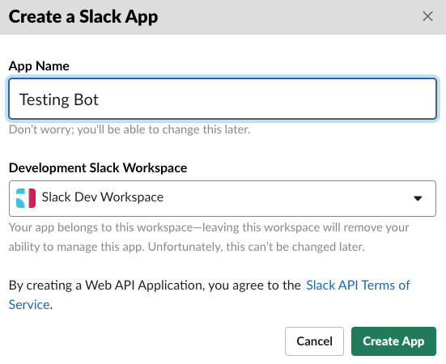

# How to build a slack bot in 2020

# Install Botkit
```
npm install -g yo generator-botkit
```

# Create your bot
```
mkdir mybot && cd mybot && yo botkit
```
When asked for messaging platform, select `slack`

# Start your bot
```
npm start
```
If you set it up properly, you would see on consle:
```sh
Webhook endpoint online:  http://localhost:3000/api/messages
```

[Read more](https://botkit.ai/getstarted.html)

Now,

[Create a Slack app](https://api.slack.com/apps/new) (if you don't already have one). Give it  a nice name and select the workspace you would like it to be added to:



Once created, you will see the below screen. Select **Bots**:


Once done, you need to navigate to **Basic Information** item in the sidebar:


Scroll down to **Display Information** block and update the display info for the bot: 


Scroll up to **App Credentials** block and copy the **Signing Secret** to be used later in some place: 


Next you need to navigate to **OAuth & Permissions** item in the sidebar and scroll down to **Scopes**, add an OAuth Scope i.e `channel:history`:


Once added, you can scroll up to **OAuth Tokens & Redirect URLs** and hit the **Install App to Workspace** button:


Hit **Allow** in the next screen:


Once you are back to the settings page, copy the **Bot User OAuth Access Token** to be used later in some place: 


Awesome 🎉 Now you have both the `CLIENT_SIGNING_SECRET` and `BOT_TOKEN` with you. You also need `GIPHY_API_KEY` for this bot, about which you can [read here](https://developers.giphy.com/docs/api/endpoint/)

At this point you should go ahead and deploy to Heroku, filling in the details when asked during app creation


You will have access to a publically available url. For example here, we will use `https://example.heroku.com/`

Once ready, you need to navigate to **OAuth & Permissions** item in the sidebar and add this url to **Redirect URLs**:


Next, you need to navigate to **Event Subscriptions** item in the sidebar, enable events and add your url with `/api/messages` appended to it. i.e `https://example.heroku.com/api/messages` :


> The URL will be validated so that the bot is up or not.

Next, you need to navigate to **Interactivity & Shortcuts** item in the sidebar, enable Interactivity and add your url with `/api/messages` appended to it. i.e `https://example.heroku.com/api/messages` to both **Request URL** and **Options Load URL**:


That should be all. Now code your bot and deploy to heroku. You should be able to interact with it inside Slack.