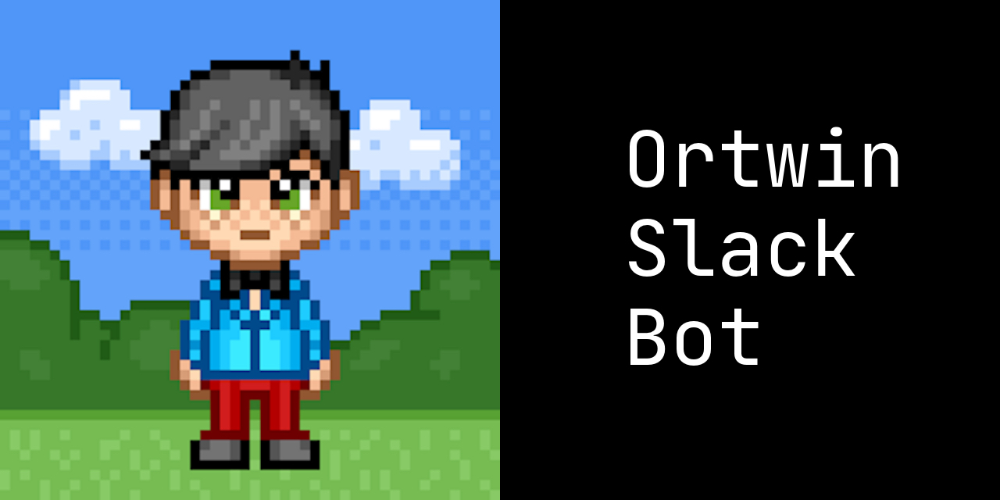

# 🛎 Your point friend in the slack workspace

[Botkit Docs](https://botkit.ai/docs/v4)

## Ortwin ? 🙄

The name of this bot means Point friend. Ortwin is a slack bot that is there to help everyone out, being a friend and single point of access for cheering everyone in workspace. Ortwin can do various things like responding with GIFs or reacting to messages 😊

Things Ortwin can do

- When someone says "morgan" or "morgen", Ortwin will reply in a thread with Morgan Freeman GIF 🤪
- When someone says "good morning" or "good bye", then respond with emoji reaction.
- When you direct message or mention Ortwin and
  - Say "programming quote", he will respond with a programming quote.
  - Say "xkcd", he will respond with latest xkcd comic.
  - Say "weather", he will respond with the weather for the city (it is hard coded to Berlin, but you can pass a different one if you want to).
  - Say "hi", he will introduce himself.
  - Say "happy birthday", he will wish you.
  - Say "faq", he will list out the links.
  - Say "lunchtime", he will react with a food emoji (sometimes, to avoid spamming the channel)

Rest the code is self explanatory. Hack away 🤓

## Avatar for Slack

Download the avatar from below to use in Slack:

## Deploy to Heroku

## Develop on Local

To complete the configuration of this bot when developing on local, make sure to create an `.env` file with your platform tokens and credentials.

Check out the [dev-docs](/dev-docs) for more!

> All development happens inside the [`features`](/features) directory of this repository and you would mostly need to make changes there

### Contribute

1. Fork this repo.
1. Clone your fork. (`git clone https://github.com/nisrulz/ortwin-slack-bot`)
1. Create your feature branch. (`git checkout -b my-new-feature`)
1. Commit your changes. (`git commit -am 'Added some feature'`)
1. Push to the branch. (`git push origin my-new-feature`)
1. Create new Pull Request.

### Author & support

This project was created by [Nishant Srivastava](https://github.com/nisrulz/nisrulz.github.io#nishant-srivastava) but hopefully developed and maintained by many others. See the [the list of contributors here](https://github.com/nisrulz/ortwin-slack-bot/graphs/contributors).

If you appreciate my work, consider [buying me](https://www.paypal.me/nisrulz/5usd) a cup of :coffee: to keep me recharged :metal: [[PayPal](https://www.paypal.me/nisrulz/5usd)]

### License

© 2020, Nishant Srivastava

All content is licensed under [CC BY-SA](/LICENSE.md)
