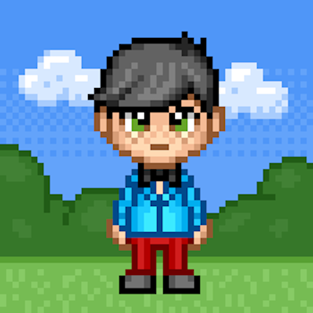

To complete the configuration of this bot, make sure to create an `.env` file with your platform tokens and credentials.

[Botkit Docs](https://botkit.ai/docs/v4)

## Ortwin ? 🙄
The name of this bot means Point friend. Ortwin is a slack bot that is there to help everyone out, being a friend and single point of access for cheering everyon in workspace. Ortwin can do various things like responding with GIFs or reacting to messages 😊

## Avatar for Slack
Download the avatar from below to use in Slack:

## Deploy to Heroku

### Contribute

1. Fork this repo.
1. Clone your fork. (`git clone https://github.com/nisrulz/ortwin-slack-bot`)
1. Create your feature branch. (`git checkout -b my-new-feature`)
1. Commit your changes. (`git commit -am 'Added some feature'`)
1. Push to the branch. (`git push origin my-new-feature`)
1. Create new Pull Request.

### Author & support

This project was created by [Nishant Srivastava](https://github.com/nisrulz/nisrulz.github.io#nishant-srivastava) but hopefully developed and maintained by many others. See the [the list of contributors here](https://github.com/nisrulz/ortwin-slack-bot/graphs/contributors).

If you appreciate my work, consider [buying me](https://www.paypal.me/nisrulz/5usd) a cup of :coffee: to keep me recharged :metal: [[PayPal](https://www.paypal.me/nisrulz/5usd)]

### License

© 2020, Nishant Srivastava

All content is licensed under [CC BY-SA](/LICENSE.md)